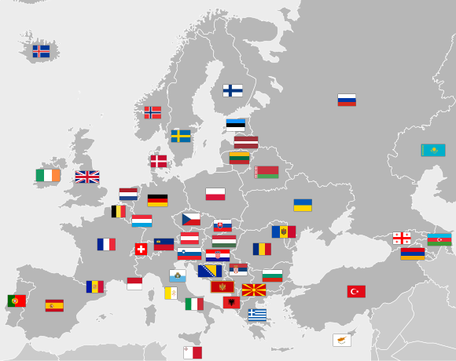

# My Flags

A place where I can simply COPY flag emoji.

Using Desktop browsers on MacOS I frequently use emojis of flags for visual representation (in Excel files, in Google Maps, in images while editing, in blog posts, etc.), and frequently I an actual emoji of country flags. NOT always keyboard is available like on iOS. Plus I sometimes need a bigger size of flag emoji to see it better.

I used to use MacOS note, where I put most frequently used flags emojis from iOS keyboard, and increased by size those which most used. Instant sync between devices is great.

But now, having this small app/page, I can always have a handy way on my Desktop to copy emoji and paste elsewhere.





## TODO (for sure)
- Introduce regions.
- Fixup Mobile view, although not really needed.
- Cleanup/Refactor code.


## TODO (maybe)
- Maybe something else, like map so that easier to locate visually.
- Maybe search by code, eg. `en`, `ua` or by full name of country. Sometimes country code is sometimes useful to search by.
- Maybe Small Countries dedicated section/region.
- Maybe some sections of flags those which "misleading", eg. Poland and Monaco vs. Indonesia, Singapore and Poland, etc.
  - Maybe section of flags of different cities, like Polish Katowice flag is very similar to flag of Ukraine.
- Maybe dedicated section for flags of countries which are NOT yet officially accepted by all other countries. Like flag of Crimea...
- Maybe section for flags of republics, like in russia. FamilyTreeDNA does it somehow, so I could :)


## Technical maybe

- Using API call is OK for now - https://restcountries.com/v3.1/all. But maybe I will cache results into JSON file.

- Maybe I will use React/TypeScript or at least Bootstrap CSS, but not sure if worth it.


## Local run

Once:

```sh
npm install http-server --global
```

When needed:

```sh
http-server .
```


## Credits

Inspired by:
- flags themselves :)
- https://en.wikipedia.org/wiki/Flags_of_Europe
- https://en.wikipedia.org/wiki/Flags_of_Asia
- https://emojipedia.org/flags#grid

